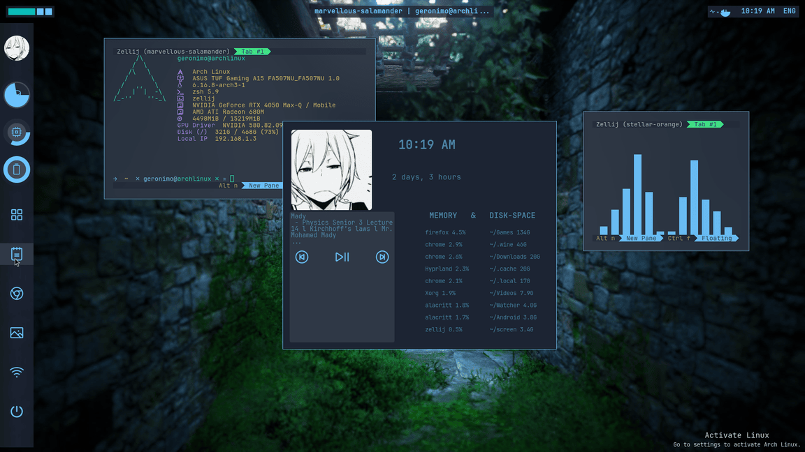

<p align="center">
        <br/>
<br>
        
        
        
         <br>

<p align="center">


---
    

# File structure:

####  📁 hypr/ wm config and fabric widgets (top bar, side bar, notifs and applauncher)

####  📁 alacritty/ my terminal config

####  📁 neofetch/ the fetch, cuz, i use arch btw

####  📁 nvim/ my neovim config of nvchad

####  📁 themes/ my vencord theme

####  📁 zellij/ my zellij config 

---


###  Demo

 

</br>   
<p align="center">

  <video src="https://github.com/user-attachments/assets/ae02694a-3e7f-4eeb-b0ac-697c3f421222">

</p>


---

# Installation

> [!WARNING]
> Please keep in mind this was made for the Arch Linux distro, so its stability is not guaranteed and will probably require your manual intervention occasionally. 

</br>
Simply clone the repo, make install.sh executable, and execute it.  

```bash
git clone https://github.com/AnasDEV2005/LobOS.git
cd LobOS
chmod +x install.sh 
./install.sh

# or for other distros, modify the ./other_distro_install.sh file accordingly, then:
chmod +x other_distro_install.sh 
./other_distro_install.sh
```

</br>

> [!NOTE]
> The `arch_installations.sh` script contains the necessary dependencies, and more AUR applications that are my personal installations.
I only commented out the unnecessary packages, so feel free to uncomment the ones you want installed.

# Further Instructions
</br>
To replace the profile picture:  

```
cp [YOUR_PFP_PATH] ~/.config/hypr/pfp.jpg
```
</br>  

Any desktop wallpapers you download need to be put in *~/wallpapers* and they will be loaded in the wallpaper picker when the hyprland session is restarted.</br>

The lock screen wallpaper should be in *~/wallpapers/Wallpaper.jpg*

> [!NOTE]
> The `ctrl+L` keybinding allows you to lock the screen at any point during a session. Can be configured in `hyprland.conf`


</br>

> [!NOTE]
> The lockscreen password is hardcoded inside `hypr/widgets/lockscreen/lockwindow.py`. The default password is 1234.

>[!NOTE]
>The ctrl+w keybinding is set to bail you out until you comment it out in the same file.


>[!NOTE]
>If you right click above the bar or in an empty space on the screen, it'll show a panel containing ram and ssd usage info, and visually incomplete but functional video/audio player controls.

</br>


